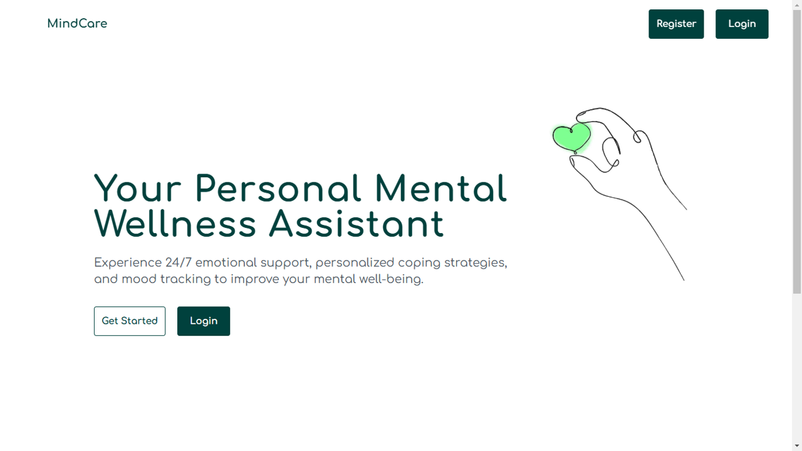

<p align="center">
  
</p>

<p align="center">
  
  
  
  
  
</p>


The user-facing side of MindCare. A React application that gives people a calm, structured space to talk, understand their emotional patterns, and build healthier habits — one day at a time.

---

## 🗂️ Part of the MindCare System

| Repo | Role |
|------|------|
| **`frontend`** ← you are here | React UI — chat, dashboard, user pages |
| [`backend`](https://github.com/silura-008/backend) | Django REST API — data, auth, Rasa bridge |
| [`bot_parellel`](https://github.com/silura-008/bot_parellel) | Rasa chatbot — NLU, dialogue management |

**Request flow:** React → Django REST API → Rasa

---

## 🖥️ Pages

### Authentication
| Page | Description |
|------|-------------|
| **Landing** | Introduction to MindCare — what it is and why it exists |
| **Register** | Sign up with name, email, country, and initial coping preferences |
| **Login** | Authenticate and enter the app |
| **Forgot Password** | Request a password reset |
| **Reset Password** | Set a new password via reset link |

### Core App
| Page | Description |
|------|-------------|
| **Profile** | Update name, country, and coping type preferences |
| **Dashboard** | 7-day mood trend graph, task streak, recent mood history |
| **Chat** | Real-time conversation with the MindCare chatbot |

---

## 💬 The Chat Experience

The chat window is the heart of the app. A few things worth understanding about how it works:

- 👍 **Response feedback** — after every bot message, users can 👍 or 👎 the response and leave a comment. This isn't decorative — the feedback is stored and forms the foundation for future model improvement.

- ⏱️ **Session awareness** — if the user goes inactive for 10 minutes, the session resets cleanly. Sharing an emotion again restarts the conversation naturally, with no awkward state carry-over.

- 🪞 **What you see reflects who you are** — because the bot's responses are shaped upstream by the user's personality type and preferences (handled by the backend and Rasa), two different users having the same conversation will see genuinely different replies. The frontend renders it — the intelligence lives upstream.

---

## 📊 The Dashboard

The dashboard surfaces patterns users might not notice day-to-day:

- 📈 **7-day emotion trend graph** — how mood has shifted across the week, visualised
- 📓 **Mood log** — past entries with emotion, personal notes, and task completion rate
- 🔥 **Task streak** — consecutive days of task completion, designed to reinforce consistency

---

## 🛠️ Tech Stack

| Component | Technology |
|-----------|-----------|
| Framework | React 18 + Vite |
| Styling | Tailwind CSS |
| Language | JavaScript ES6+ |
| API | REST calls to Django backend |

---

## 🖼️ Screenshots

**Landing**


**Dashboard**


**Profile**


**Chat**


---

## ⚙️ Local Setup

```bash
git clone https://github.com/silura-008/frontend.git
cd frontend
npm install
npm run dev
```

Frontend runs at `http://localhost:5173`

> Django backend must be running at `http://localhost:8000` for API calls to work.  
> See [backend setup](https://github.com/silura-008/backend).

---

## 🔗 Related Repos

- [**Backend**](https://github.com/silura-008/backend) — Django REST API
- [**Chatbot**](https://github.com/silura-008/bot_parellel) — Rasa Engine
